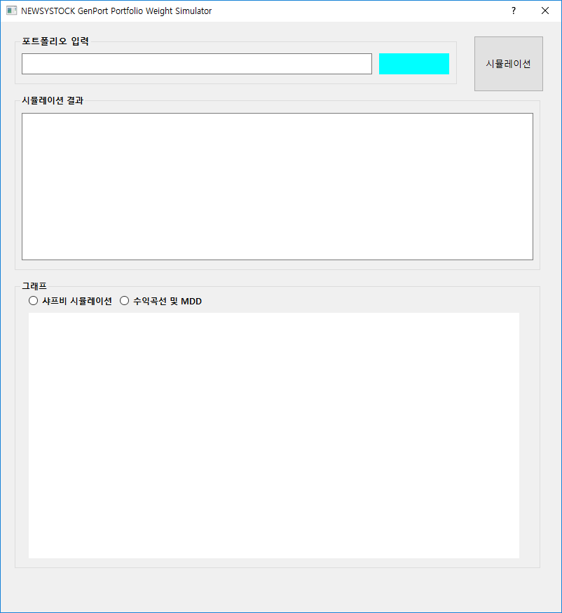
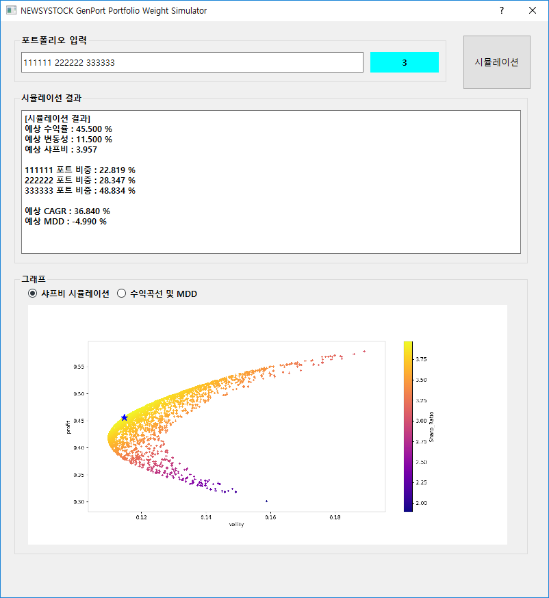
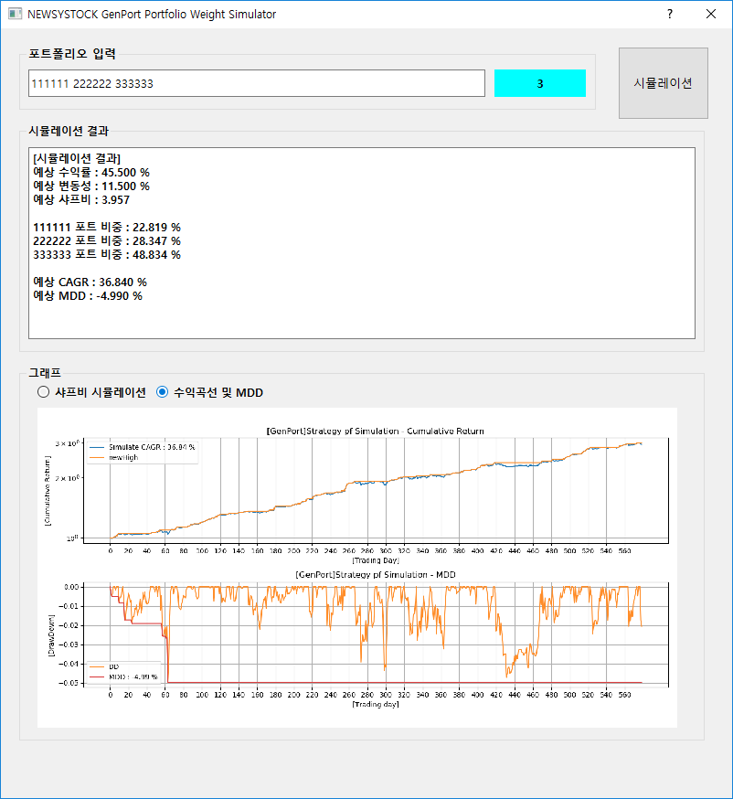

# NEWSYSTOCK GenPort Plugin
젠포트를 보조해주는 프로그램입니다.

(나중에 뉴지스탁에서 구현해주길 바라는 내심(?)이 담겨있어 플러그인이라는 이름을 붙였습니다.)

## 실행 환경 세팅
Anaconda와 파이썬을 설치해주면 됩니다.

## 개발 환경
OS: `WINDOW 10`

개발환경 : Visual Studio 2019

개발 버전 : Python 3.7, Anaconda 2019.03

사용 패키지 : Numpy, Pandas, Matplotlib, datetime

## 사용방법
1. 파일을 다운로드 받습니다.

2. 파일을 받은 위치에 일별 거래내역을 다운로드 받아 저장합니다.

   [젠포트] - [포트 관리하기] - 원하는 포트 선택 - [거래내역] - [엑셀로 내보내기]를 하면
   trade_history_daily_(포트번호).csv 파일이 다운로드 됩니다.
   
3. frontend.py를 실행합니다.

4. 조합하고 싶은 포트폴리오 번호를 5개 입력해줍니다.(2개 ~ 5개)

   
   
   입력은 (포트1번 번호) (포트2번 번호) (...) 식으로 입력하면 됩니다. 
   
   예시) 111111 222222 333333 444444 555555 (6자리 입력후 구분위해 스페이스 한번 눌려주고 입력)
   
5. 시뮬레이션이 됩니다.   

## 구현 화면

Log 화면에 샤프비가 최대일때 수익률, CAGR, 변동성, MDD, 각 포트폴리오별 비중이 시현됩니다.

사진에는 2500회의 시뮬레이션 결과 및 가장 Sharp Ratio가 높을때 변동성 - 수익률 위치를 보여줍니다.

샤프비율이 가장 높을때 비중으로 투자했을 경우 수익 그래프 및 MDD를 보여줍니다.

* 만약 화면이 작아 보이면 파일을 저장한 곳에 원본 사진이 출력되니, 그 파일을 열어 보시는 것을 권장합니다.

## 현재 구현기능
2019-05-27 : 최대 샤프비 산출 및 비중투자시 수익곡선 

2019-05-29 : GUI 구현

## 기타
1. 1년을 252거래일로 설정하여 시뮬레이션 됩니다.
2. 젠포트 전략 연구 오픈카톡방, 파이스탁, 작성자 블로그에서 배포됩니다.

#### 참고 글
https://cafe.naver.com/pystock/2515
[포트폴리오 최적화 소스]

https://github.com/HanSonCoding/genportAnasisProject
[HanSonCoding/genportAnasisProject]
